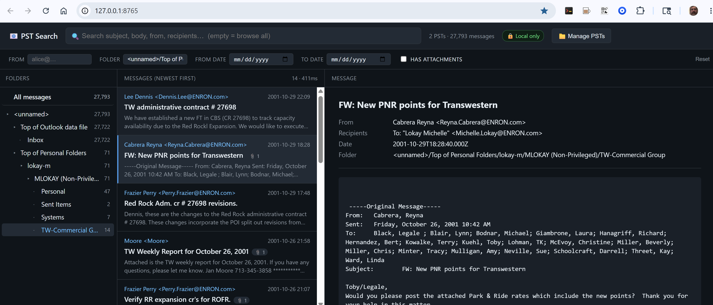

# PST Search

A local search engine for Outlook PST files. Index once, then search by subject, body, sender, recipients, folder, or date — and pull attachments directly from the source PST on demand. Built around SQLite FTS5 for instant full-text search.



## Why this exists

`libpff` (the standard PST reader used by most Python tools) has a long-standing unfixed bug — `libpff_table_read: invalid table - missing data identifier` — that makes it unable to read certain real-world PSTs, especially those produced by recent Outlook versions. We hit that on a real 8GB mailbox: libpff couldn't read a single message. `pst-search` uses an independent codebase (`pst-extractor`, a Node.js port of `java-libpst`) and reads PSTs that libpff cannot.

## Features

- **Full-text search** across subject, body, sender, recipients, and folder path. FTS5-ranked, with `<mark>`-highlighted snippets.
- **Gmail-style operators** in the search box: `from:bob`, `to:alice`, `subject:budget`, `body:meeting`, `folder:inbox`, combined with `AND`/`OR`/`NOT`, quoted phrases, prefix matching (`meet*`), and parentheses. Click the **?** next to the search box for the full cheatsheet.
- **Browse mode** — leave the search box empty to list messages newest-first; click any folder in the tree to filter to it.
- **Sort by date or relevance** — dropdown in the result-list header switches between Newest first (default), Oldest first, and Relevance (BM25 ranking for search queries).
- **Filters**: from, to, folder, date range, has-attachments.
- **Lazy attachments**: the index stores only filenames and sizes. Clicking an attachment re-opens the PST and extracts that one file on demand. No multi-GB attachment dump on disk.
- **Multiple PSTs** in one index. Re-indexing a PST replaces its rows in place.
- **Local-only**: everything runs on `127.0.0.1`. No data leaves your machine.

## Quick start

### Prerequisites (one-time per machine)

The app needs Python and Node.js at runtime. **Git is not required** — you can either `git clone` or just download the source as a ZIP.

| | Windows | macOS | Linux (Ubuntu/Debian) |
| --- | --- | --- | --- |
| Python 3.10+ | `winget install Python.Python.3.12` | `brew install python@3.12` | `sudo apt install python3 python3-pip python3-tk python3-venv` |
| Node.js 18+ | `winget install OpenJS.NodeJS.LTS` | `brew install node` | `sudo apt install nodejs npm` |

> **macOS Homebrew users**: also run `brew install python-tk@3.12` so the file picker dialog works. (The python.org installer includes it already.)

### Get the source

Either:

```bash
# If you have git installed:
git clone https://github.com/KD5RYN/pst-search
cd pst-search
```

…or **download as a ZIP** from <https://github.com/KD5RYN/pst-search> (green **Code** button → **Download ZIP**), then unzip and `cd` into the folder.

### Install

Two commands — same on every OS:

```bash
pip install -e .
(cd pst_search/node && npm install)
```

On Windows PowerShell the second line is:

```pwsh
cd pst_search\node; npm install; cd ..\..
```

### Run

```bash
pstsearch serve
```

A browser tab opens at <http://127.0.0.1:8765>.

1. Click **📁 Manage PSTs → + Add another PST**
2. Pick your `.pst` file in the native dialog
3. **Adjust indexing options** (or accept defaults) and click **Start indexing**
4. Search as soon as the first batch lands; the rest streams in behind you

When it's done, search.

The search index lives in your per-user data directory:

- Windows: `%APPDATA%\pst-search\index.db`
- macOS: `~/Library/Application Support/pst-search/index.db`
- Linux: `$XDG_DATA_HOME/pst-search/index.db` (default `~/.local/share/pst-search/index.db`)

Delete that file to wipe the index and start over.

## Search syntax

The search box accepts the same operators most users already know from Gmail and Outlook, plus all of SQLite FTS5's native query language.

**Operators:**

| Type | Means |
| --- | --- |
| `from:bob` | sender name or email contains "bob" |
| `to:alice` | any recipient (To/Cc/Bcc) contains "alice" |
| `subject:budget` | match restricted to the subject |
| `body:meeting` | match restricted to the body |
| `folder:inbox` | folder path contains "inbox" |
| `cc:` / `bcc:` | recipients (we don't distinguish To/Cc/Bcc) |

**Combining:**

| Form | Means |
| --- | --- |
| `a b` | both words present (implicit AND) |
| `a AND b` | both — explicit |
| `a OR b` | either |
| `a NOT b` | a but not b |
| `"q4 plan"` | exact phrase |
| `meet*` | prefix — matches meeting, meetup, meets, … |
| `(a OR b) AND c` | group with parens |

**Example:** `from:bob AND subject:budget NOT folder:trash` — emails from Bob about budgets that aren't in any trash folder.

Click the **?** icon at the right edge of the search box for a popup version of this cheatsheet.

## Indexing options

The "Add a PST" dialog and the `pstsearch index` CLI command both expose the same three knobs. Defaults work for almost every mailbox; tweak them only when the defaults don't fit your data.

| Option | GUI label | CLI flag | Default | When to change |
| --- | --- | --- | --- | --- |
| Include message bodies | _Index message bodies_ (checkbox) | `--no-body` | on | Off for **huge archives** when you only need to search by subject/sender — indexing becomes dramatically faster. |
| Max body length kept | _Max body length per message_ | `--body-cap KB` | 32 KB | Raise (up to 1024 KB) if your real-content emails routinely run longer; lower to shrink the index. |
| Skip body for very large messages | _Skip bodies larger than_ | `--max-html-fetch MB` | 4 MB | Lower if you want to ignore giant newsletter-style mail; raise toward 100 MB if you specifically want body text from huge messages too. |

Open the **Advanced options** disclosure in the Add-PST dialog to see and adjust the last two.

## App settings (⚙️ button)

Click the gear icon in the header to see what the server is currently doing:

- **Listening at** — the URL the server is bound to
- **Network access** — confirms whether you're local-only or exposed
- **Index database** — where the SQLite file lives, with an **Open data folder** button

These are read-only because changing them requires restarting the server. To change them, pass flags to `pstsearch serve` (see below).

## Commands

```
pstsearch serve  [--host HOST] [--port PORT] [--db PATH] [--no-browser]
    Launch the web UI. Defaults: --host 127.0.0.1 --port 8765.
    Pass --host 0.0.0.0 to expose to your LAN (DO NOT do this on an
    untrusted network — anyone reaching the port can search your mail).

pstsearch index FILE.pst
                 [--no-body]
                 [--body-cap KB]
                 [--max-html-fetch MB]
                 [--db PATH]
    Index a PST from the command line. Re-running on the same file
    replaces its rows. Options mirror the GUI Add-PST dialog.

pstsearch list
    Show indexed PSTs (id, message count, path, indexed-at).
```

## Architecture

```
PST file --[Node + pst-extractor]--NDJSON--> Python indexer --[SQLite + FTS5]--> Search API --[HTML/JS]--> Browser
                                                                                       |
                                                                              (on attachment click,
                                                                               spawn Node, extract
                                                                               one attachment by
                                                                               descriptor node ID)
```

| Layer | File | Purpose |
| --- | --- | --- |
| PST extractor | `pst_search/node/extract.mjs` | Walks the PST with `pst-extractor`, streams one NDJSON record per message to stdout. |
| Attachment extractor | `pst_search/node/attachment.mjs` | Pulls a single attachment's bytes from a PST by descriptor node ID. |
| Python driver | `pst_search/pst.py` | Spawns Node, parses NDJSON, exposes Python iterators and an attachment-fetch function. |
| Indexer | `pst_search/indexer.py` | Consumes the message stream and bulk-inserts into SQLite. |
| Database | `pst_search/db.py` | Schema + FTS5 virtual table + search/browse queries. |
| Server | `pst_search/server.py` | FastAPI endpoints: `/api/search`, `/api/folders`, `/api/message/{id}`, `/api/attachment/{msg}/{idx}`. |
| Web UI | `pst_search/web/index.html` | Single-file frontend (HTML + inline CSS + JS), no build step. |
| CLI | `pst_search/cli.py` | `index` / `serve` / `list` entry points. |

## Performance notes

- Indexing throughput is ~35 messages/sec end-to-end on a typical desktop. An 8GB / 27K-message PST takes ~13 minutes.
- The Node side caps stored body text at 32 KB per message (configurable via `PST_SEARCH_BODY_CAP`). 32 KB is roughly 5,000+ words — well past the length of normal correspondence.
- For genuinely enormous messages (over 4 MB total), the HTML body fetch is skipped to keep indexing predictable (`PST_SEARCH_MAX_HTML_FETCH`). On a typical mailbox this affects far less than 1% of messages. Subject, sender, recipients, and folder are always indexed.
- Recipients are parsed from `transportMessageHeaders` instead of `pst-extractor`'s `getRecipient()` API. The API call hits disk per recipient and dominates indexing time on big PSTs (measured 120 ms/message vs effectively free for header parsing).

## License

`pst-search` is MIT-licensed (see `LICENSE`). Third-party dependencies and their licenses are listed in `THIRD_PARTY_LICENSES.md`.

## Known limitations

- **Search folders are skipped.** Some PSTs have internal "search root" folders (`SPAM Search Folder 2`, `ItemProcSearch`, etc.) that contain search caches rather than user mail; `pst-extractor` can't enumerate them and we explicitly skip them. No real mail is missed.
- **Body text is capped at 32 KB per message.** Most emails fit well under this; marketing emails with hundreds of KB of HTML get truncated, but the useful content (greeting, offer, call-to-action) is always in the first few KB. Tunable via `PST_SEARCH_BODY_CAP`.
- **Bodies are skipped for messages larger than 4 MB.** This affects the rare giant message (e.g., one with embedded multi-MB inline images). Their subject/sender/recipients/folder are still indexed. The detail pane shows "(empty body)" for those. Tunable via `PST_SEARCH_MAX_HTML_FETCH`.
- **No incremental indexing.** Re-running `index` on the same PST replaces all its rows. Fine for static archives; not designed for live mailboxes.

